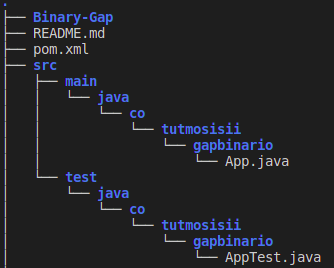

# Obtener el espacio  más grande de Ceros en un número binario.

El algoritmo a desarrollar debe obtener la distancia más grande de ceros entre un par
de unos de un número binario.

Ejemplos:

| Binario  | Gap  | Distancia   |
|---|---|---|
|10001001|10001   | 3  |
|1000|   | 0  |
|1111|   | 0  |


Para reolver el reto no solo es necesario completar el algoritmo sino también hacer
uso de técnicas de TDD. Cada Test que se adicione tendrá una rama separa para talfin.

La rama Test1 contendrá el primer Test y se hará un commit por cada uno de los pasod
de TDD en la respectiva rama.
## Test1

La brueba busca tener pruebas para los 3 ejemplos mostrados acá.
Lo primero es hacer que el tes falle devolviendo la respueata incorrecta así:

| Binario  | Gap  | Distancia   |
|---|---|---|
|10001001|10001   | 0  |
|1000|   | 3  |
|1111|   | 1  |


Esta prueba se hace usando maven:

```bash
mvn test
```


## Estructura del proyecto



## Pasos de TDD

1. Test fallando
1. Mínimo test funcionando
1. Funcionalid implementada

## Visual Studio Devcontariner

Este proyecto hace uso de VisualStudio Devcontariner para tener un ambiente de desarrollo
mínimo.

## ¿Cómo crear el proyecto inicial?

mvn archetype:generate -DgroupId=co.tutmosisii.gapbinario -DartifactId=Binary-Gap -DarchetypeArtifactId=maven-archetype-quickstart -DarchetypeVersion=1.4 -DinteractiveMode=false
